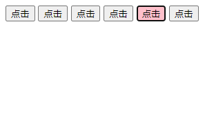

# jQuery学习笔记

## 01--jQuery的基本使用

- **引入jQuery**

  - ```
    npm install jquery
    ```

  - ```javascript
    <script src="../node_modules/jquery/dist/jquery.min.js"></script>
    ```

- ```html
  <body>
    <script> 
      $(function() {
        $('div').hide();
      })
    </script>
    <div>
  
    </div>
  </body>
  ```

  等着页面加载完毕再去执行js代码

- 等着DOM结构渲染完毕即可执行内部代码，不必等到所有外部资源加载完毕；
- 相当于原生js中的DOMContentLoaded；
- 不同于原生js中的load事件是等页面文档、外部js文件、css文件、图片加载完才执行内部代码；
- **JQuery的顶级对象$**
  - $是jQuery的别称；
  - $是jQuery的顶级对象，相当于原生JavaScript的window。把元素利用$包装成jQuery对象，就可以使用jQuery的方法；

- **jQuery的对象和DOM对象**
  - jQuery获取对象的方式是：
    - $(‘div’),$(.class),$(#id)等等；
  - js原生获取对象的方式是：
    - var div = document.getElementsByTagName(‘div’)等等；
  - jQuery获取的对象和js原生获取的对象之间，方法不能混用；

- DOM对象与jQuery对象之间的互相转换

  - 为什么需要转换

    - 因为原生的js比jQuery更大，原生的一些属性和方法jQuery没有进行封装，要想使用这些属性和方法需要把jQuery对象转换为DOM对象才能使用；

  - 如何转换

    - 原生js对象转换为jQuery对象：

      - ```javascript
        var myDiv = document.getElementById('#id')
        ```

      - $(myDiv)这样即可转换

    - jQuery对象转换为DOM对象：

      - ```
        //第一种
        $('video')[0]
        //第二种
        $('video').get[0]
        ```


## 02--jQuery常用API

### 02-01 jquery基础选择器

- $("选择器")     //里面选择器直接写css选择器即可，但是要加引号；


- | 名称       | 用法             | 描述                     |
  | ---------- | ---------------- | ------------------------ |
  | ID选择器   | $("#id")         | 获取指定ID的元素         |
  | 全选选择器 | $("*")           | 匹配所有元素             |
  | 类选择器   | $(".class")      | 获取同一类class元素      |
  | 标签选择器 | $("div")         | 获取同一类标签的所有元素 |
  | 并集选择器 | $("div,p,li")    | 选取多个元素             |
  | 交集选择器 | $("lli.current") | 交集元素                 |

### 02-02 jquery层级选择器

| 名称       | 用法       | 描述                                                         |
| ---------- | ---------- | ------------------------------------------------------------ |
| 子代选择器 | $('ul>li') | 使用>号，获取亲儿子的层级元素；注意，并不会获取孙子层级的元素 |
| 后代选择器 | $('ul li') | 使用空格，代表后代选择器，获取ul下边的所有li元素，包括孙子等 |

### 02-03jquery隐式迭代

- 隐式迭代
  - 遍历内部DOM元素（伪数组形式存储）的过程叫做隐式迭代；
  - 给匹配到的所有元素进行循环遍历，执行相应的方法，而不用我们再进行循环，简化我们的操作；

### 02-04 jquery筛选选择器

| 语法       | 用法          | 描述                                                 |
| ---------- | ------------- | ---------------------------------------------------- |
| :first     | $('li:first') | 获取第一个li元素                                     |
| :last      | $('li:last')  | 获取最后一个li元素                                   |
| :eq(index) | $('li:eq(2)') | 获取到的li元素中，选择索引号为2的元素，索引号从0开始 |
| :odd       | $('li:odd')   | 获取到的li元素中，选择索引号为奇数的元素             |
| :even      | $('li:even')  | 获取到的li元素在，选择索引号为偶数的元素             |

### 02-05 jQuery筛选方法


### 02-06下拉菜单

```html
<style>
    * {
      margin: 0;
      padding: 0;
    }
    li {
      list-style: none;
    }
    a {
      text-decoration: none;
      width: 50px;
      display: block;
      border-bottom: 1px solid black;
     
    }
    .nav {
      margin-left: 20px;
      margin-top: 20px;
    }
    .nav>li {
      float: left;
      font-size: 8px;
      border-left: 1px solid black;
      border-right: 1px solid black;
      border-top: 1px solid black;
      text-align: center;
      margin-left: -1px;
    }
    .nav>li>ul {
      display: none;
    }
  </style>
</head>
<body>
  <ul class="nav">
    <li>
      <a href="#">微博</a>
      <ul>
        <li>
          <a href="#">私信</a>
        </li>
        <li>
          <a href="#">评论</a>
        </li>
        <li>
          <a href="#">@我</a>
        </li>
      </ul>
    </li>
    <li>
      <a href="#">微博</a>
      <ul>
        <li>
          <a href="#">私信</a>
        </li>
        <li>
          <a href="#">评论</a>
        </li>
        <li>
          <a href="#">@我</a>
        </li>
      </ul>
    </li>
    <li>
      <a href="#">微博</a>
      <ul>
        <li>
          <a href="#">私信</a>
        </li>
        <li>
          <a href="#">评论</a>
        </li>
        <li>
          <a href="#">@我</a>
        </li>
      </ul>
    </li>
    <li>
      <a href="#">微博</a>
      <ul>
        <li>
          <a href="#">私信</a>
        </li>
        <li>
          <a href="#">评论</a>
        </li>
        <li>
          <a href="#">@我</a>
        </li>
      </ul>
    </li>
  </ul>
  <script>
    $(function() {
      $('.nav>li').mouseover(function() {
        $(this).children('ul').show();
      })
      $('.nav>li').mouseleave(function() {
        $(this).children('ul').hide();
      })
    })
  </script>
</body>
```

### 02-07jquery筛选方法2

- siblings: 除了自身元素之外的所有亲兄弟

  - 代码

  ```html
  <body>
    <ol>
      <li>我是ol的li</li>
      <li>我是ol的li</li>
      <li class="item">我是ol的li</li>
      <li>我是ol的li</li>
      <li>我是ol的li</li>
      <ul>
        <li>haha</li>
      </ul>
    </ol>
    <ul>
      <li>我是ul的li</li>
      <li>我是ul的li</li>
      <li>我是ul的li</li>
      <li>我是ul的li</li>
      <li>我是ul的li</li>
    </ul>
    <script>
      $(function() {
        $('ol .item').siblings().css('color', 'red')
      })
    </script>
  </body>
  ```

  - 效果

  

- nextAll: 插找当前元素之后的所有同辈元素

  - 代码

  ```HTML
  <body>
    <ol>
      <li>我是ol的li</li>
      <li>我是ol的li</li>
      <li class="item">我是ol的li</li>
      <li>我是ol的li</li>
      <li>我是ol的li</li>
      <ul>
        <li>haha</li>
      </ul>
    </ol>
    <ul>
      <li>我是ul的li</li>
      <li>我是ul的li</li>
      <li>我是ul的li</li>
      <li>我是ul的li</li>
      <li>我是ul的li</li>
    </ul>
    <script>
      $(function() {
        $('ol .item').nextAll().css('color', 'red')
      })
    </script>
  </body>
  ```

  
  - 效果

  

- prevAll: 检查当前元素之前所有的同辈元素

  - 代码

  ```html
  <body>
    <ol>
      <li>我是ol的li</li>
      <li>我是ol的li</li>
      <li class="item">我是ol的li</li>
      <li>我是ol的li</li>
      <li>我是ol的li</li>
      <ul>
        <li>haha</li>
      </ul>
    </ol>
    <ul>
      <li>我是ul的li</li>
      <li>我是ul的li</li>
      <li>我是ul的li</li>
      <li>我是ul的li</li>
      <li>我是ul的li</li>
    </ul>
    <script>
      $(function() {
        $('ol .item').prevAll().css('color', 'red')
      })
    </script>
  </body>
  ```

  

  - 效果

  

- 第n个元素

  - 选择器的方式

    - 代码

    ```html
    <body>
      <ul>
        <li>我是ul的li</li>
        <li>我是ul的li</li>
        <li>我是ul的li</li>
        <li>我是ul的li</li>
        <li>我是ul的li</li>
      </ul>
      <script>
        $(function() {
          $('ul li:eq(2)').css('color', 'green')
        })
      </script>
    </body>
    ```

    - 效果

    

  - 选择方法的方式

    - 代码

    ```html
    <body>
      <ul>
        <li>我是ul的li</li>
        <li>我是ul的li</li>
        <li>我是ul的li</li>
        <li>我是ul的li</li>
        <li>我是ul的li</li>
      </ul>
      <script>
        $(function() {
          $('ul li'）eq(2).css('color', 'yellow')
        })
      </script>
    </body>
    ```

    - 效果

    

- hasClass:  检查当前元素是否含有某个特定的类，如果有，返回true

  - 代码

```html
<body>
  <ul>
    <li>我是ul的li</li>
    <li>我是ul的li</li>
    <li>我是ul的li</li>
    <li>我是ul的li</li>
    <li>我是ul的li</li>
  </ul>
  <div class="current">有current</div>
  <div>没有current</div>
  <script>
    $(function() {
      console.log($('div:first').hasClass('current'));
    })
  </script>
</body>
```

### 02-08 jquery的排他思想

- 使用了jQuery的隐式迭代和siblings

  - 代码

  ```html
  <body>
    <button>点击</button>
    <button>点击</button>
    <button>点击</button>
    <button>点击</button>
    <button>点击</button>
    <button>点击</button>
    <script>
      $(function() {
        $('button').click(function() {
          $(this).css('background', 'pink');
          $(this).siblings('button').css('background', '');
        })
      })
    </script>
  </body>
  ```


  - 效果

  


### 02-09 淘宝服饰精品

- 核心原理：鼠标经过左侧黑子的某个小li，就让内容区盒子相对应的图片显示，其余部分隐藏

- 需要得到当前li的索引号，就可以显示对应的索引号

- jQuery得到当前元素索引号$(this).index()

- 中间对应的图片，可以通过eq(index)方法选择

- 显示元素show(),隐藏元素hide()

  - 代码

  ```html
  <style>
      * {
        margin: 0;
        padding: 0;
      }
      li {
        list-style: none;
        width: 50px;
        height: 40px;
        text-align: center;
        line-height: 40px;
        border-bottom: 1px solid black;
        border-right: 1px solid black;
  
      }
      a {
        text-decoration: none;
      }
      .left {
        /* height: 270px;
        width: 50px; */
        background-color: red;
        float: left;
        border-left: 1px solid black;
        border-top: 1px solid black;
  
      }
      .right {
        width: 100px;
        height: 163px;
        background-color: blue;
        float: left;
        border-top: 1px solid black;
        border-right: 1px solid black;
        border-bottom: 1px solid black;
  
      }
      .right div {
        width: 100px;
        height: 165px;
        text-align: center;
        line-height: 165px;
      }
    </style>
  </head>
  <body>
    <div class="wrapper">
      <div class="left">
        <ul>
        <li><a href="#">美靴</a></li>
        <li><a href="#">美靴</a></li>
        <li><a href="#">美靴</a></li>
        <li><a href="#">美靴</a></li>
        </ul>
      </div>
      <div class="right">
        <div>1</div>
        <div>2</div>
        <div>3</div>
        <div>4</div>
      </div>
    </div>
    <script>
      $(function() {
        $('.right div').eq(0).siblings().css('display', 'none')
        $('.left li').mouseover(function() {
          var index = $(this).index();
          // console.log(index)
          $('.right div').eq(index).show();
          $('.right div').eq(index).siblings().hide();
        })
      })
    </script>
  </body>
  ```

  
  - 效果

  

## 03--jQuery样式操作

### 03-01 操作CSS方法

- jQuery可以使用css方法来修改简单元素样式，也可以操作类，修改多个样式；

  - 参数只写属性名，则是返回属性值

    - ```
      $(this).css('color);
      ```

  - 参数是属性名，属性值，逗号分隔，是设置一组样式，属性必须加引号，值如果是数字可以不用跟单位和引号；

    - ```
      $(this).css('color','red');
      ```

  - 参数可以是对象形式，方便设置多组样式。属性名和属性值用逗号隔开，属性不用加引号，复合属性名，使用驼峰写法，如：backgroundColor

    - ```html
      $('div').css({
              width: 100,
              height: 100,
              backgroundColor: 'blue'
            })
      ```


### 03-02 设置类样式方法

- 作用等同于以前的classList，可以操作类样式，注意操作类里面的参数不要加点；
  - 添加类

  ```html
  $('div).addClass('current')
  ```

  - 移除类

  ```html
  $('div').removeClass('current')
  ```

  - 切换类

  ```html
  $('div').toggleClass('current')
  ```

  代码

  需求一：点击一次div从空白背景变为红色背景，再点一次，又变为空白，再点，再变红。。。。。

  ```html
  <style>
      .current {
        width: 100px;
        height: 100px;
        background-color: red;
      }
      div {
        border: 1px solid black;
        width: 100px;
        height: 100px;
      }
    </style>
  </head>
  <body>
    <div>
  
    </div>
    <script>
      $(function() {
        var click = 0
        $('div').click(function() {
          if(click == 0) {
            $(this).addClass('current');
            click = 1;
          }
          else {
            $(this).removeClass('current');
            click = 0;
          }
          
        })
      })
    </script>
  </body>
  ```

  设置一个变量click，当click == 0，变红，当click != 0 时变空白；

  但是jQuery有一个更好的方法；

  toggleClass

  ```html
  <style>
      .current {
        width: 100px;
        height: 100px;
        background-color: red;
      }
      div {
        border: 1px solid black;
        width: 100px;
        height: 100px;
      }
      div:nth-child(2) {
        background-color: blue;
        width: 100px;
        height: 100px;
        transition: all 1s;
      }
      .xuanzhuan {
        transform: rotate(360deg);
      }
    </style>
  </head>
  <body>
    <div>
  
    </div>
    <div>
  
    </div>
    <script>
      $(function() {
        $('div').eq(1).click(function() {
          $(this).toggleClass('xuanzhuan');
        })
      })
    </script>03-03  tab栏切换
  ```

### 03-03 tab栏切换

- 需求：tab栏切换，点击谁，谁对应的div内容显示出来‘

- 利用jQuery的隐式迭代的循环遍历，设置类样式方法，获取被点击的索引号；

- 代码

```html
<style>
  * {
    margin: 0;
    padding: 0;
  }
  .father {
    height: 30px;
  }
  .tab-top li {
    width: 50px;
    height: 30px;
    /* background-color: #ccc; */
    display: block;
    float: left;
    text-align: center;
    cursor: pointer;
  }
  .tab-content div {
    width: 350px;
    height: 200px;
    display: none;
  }
  .current {
    background-color: red;
  }
</style>
<body>
  <div class="father">
    <div class="tab-top">
      <ul>
        <li>1</li>
        <li>2</li>
        <li>3</li>
        <li>4</li>
        <li>5</li>
      </ul>
    </div>
  </div>
  <div class="tab-content">
    <div>1</div>
    <div>2</div>
    <div>3</div>
    <div>4</div>
    <div>5</div>
  </div>
  <script>
    $(function() {
      $('.tab-top li').click(function() {  						      			    		  	 $(this).addClass('current').siblings().removeClass('current');
        let index = $(this).index();
        console.log(index);
        $('.tab-content div').eq(index).show().siblings().hide();
      })
    })
  </script>
</body>
```

- 效果


### 03-04 类操作与className区别

原生js中className会覆盖元素原先里面的类名；

jQuery里面的类操作只是对指定类进行操作，不影响原先的类名；

## 04--jQuery效果

### 04-01 jQuery 效果-隐藏和显示

------

隐藏、显示、切换，滑动，淡入淡出，以及动画，哇哦！

```
$(document).ready(function(){    $("#flip").click(function(){        $(".panel").toggle();    });});
```

### 04-02 jQuery hide() 和 show()

通过 jQuery，您可以使用 hide() 和 show() 方法来隐藏和显示 HTML 元素：

```
$("#hide").click(function(){  $("p").hide();}); $("#show").click(function(){  $("p").show();});
```

**语法:**

```html
$(selector).hide(speed,callback);
$(selector).show(speed,callback);
```

可选的 speed 参数规定隐藏/显示的速度，可以取以下值：”slow”、”fast” 或毫秒。

可选的 callback 参数是隐藏或显示完成后所执行的函数名称。

下面的例子演示了带有 speed 参数的 hide() 方法：

```html
$("button").click(function(){
$("p").hide(1000);
});
```

下面的例子演示了带有 speed 参数的 hide() 方法，并使用回调函数：

```
$(document).ready(function(){
	$(".hidebtn").click(function({
		$("div").hide(1000,"linear",function(){
			alert("Hide() 方法已完成!");
			});
		});
	});
```

第二个参数是一个字符串，表示过渡使用哪种缓动函数。

（译者注：jQuery自身提供”linear” 和 “swing”，其他可以使用相关的插件）。

### 04-03 jQuery toggle()

通过 jQuery，您可以使用 toggle() 方法来切换 hide() 和 show() 方法。

显示被隐藏的元素，并隐藏已显示的元素：

```
$("button").click(function(){  
	$("p").toggle();
});
```

**语法:**

```
$(selector).toggle(speed,callback);
```

可选的 speed 参数规定隐藏/显示的速度，可以取以下值：”slow”、”fast” 或毫秒。

可选的 callback 参数是隐藏或显示完成后所执行的函数名称。

- 代码

```html
<style>
  .div {
    background-color: pink;
    width: 140px;
    height: 400px;
  }
</style>
<body>
  <div>
    <button>显示</button>
    <button>隐藏</button>
    <button>切换</button>
  </div>
  <div class="div">

  </div>
  <script>
    $(function() {
      $('button').eq(0).click(function() {
        $('.div').show();
      })
      $('button').eq(1).click(function() {
        $('.div').hide();
      })
      $('button').eq(2).click(function() {
        $('.div').toggle()
      })
    })
  </script>
</body>
```

### 04-04 简洁版滑动下拉菜单

- slideDown()

通过高度变化（向下增大）来动态地显示所有匹配的元素，在显示完成后可选地触发一个回调函数。

这个动画效果只调整元素的高度，可以使匹配的元素以“滑动”的方式显示出来。在jQuery 1.3中，上下的padding和margin也会有动画，效果更流畅。

**speed**:三种预定速度之一的字符串("slow","normal", or "fast")或表示动画时长的毫秒数值(如：1000)

**easing**:(Optional) 用来指定切换效果，默认是"swing"，可用参数"linear"

**fn**在动画完成时执行的函数，每个元素执行一次。

- slideUp()

通过高度变化（向上减小）来动态地隐藏所有匹配的元素，在隐藏完成后可选地触发一个回调函数。

这个动画效果只调整元素的高度，可以使匹配的元素以“滑动”的方式隐藏起来。在jQuery 1.3中，上下的padding和margin也会有动画，效果更流畅。

**speed**:三种预定速度之一的字符串("slow","normal", or "fast")或表示动画时长的毫秒数值(如：1000)

**easing**:(Optional) 用来指定切换效果，默认是"swing"，可用参数"linear"

**fn**:在动画完成时执行的函数，每个元素执行一次。

- slideToggle()

通过高度变化来切换所有匹配元素的可见性，并在切换完成后可选地触发一个回调函数。

这个动画效果只调整元素的高度，可以使匹配的元素以“滑动”的方式隐藏或显示。在jQuery 1.3中，上下的padding和margin也会有动画，效果更流畅。

**speed**:三种预定速度之一的字符串("slow","normal", or "fast")或表示动画时长的毫秒数值(如：1000)

**easing**:(Optional) 用来指定切换效果，默认是"swing"，可用参数"linear"

**fn**:在动画完成时执行的函数，每个元素执行一次。

- hover()

一个模仿悬停事件（鼠标移动到一个对象上面及移出这个对象）的方法。这是一个自定义的方法，它为频繁使用的任务提供了一种“保持在其中”的状态。

当鼠标移动到一个匹配的元素上面时，会触发指定的第一个函数。当鼠标移出这个元素时，会触发指定的第二个函数。而且，会伴随着对鼠标是否仍然处在特定元素中的检测（例如，处在div中的图像），如果是，则会继续保持“悬停”状态，而不触发移出事件（修正了使用mouseout事件的一个常见错误）。

参数

over:鼠标移到元素上要触发的函数

out:鼠标移出元素要触发的函数

```
* {
    margin: 0;
    padding: 0;
  }
  li {
    list-style: none;
  }
  a {
    text-decoration: none;
    width: 50px;
    display: block;
    border-bottom: 1px solid black;
   
  }
  .nav {
    margin-left: 20px;
    margin-top: 20px;
  }
  .nav>li {
    float: left;
    font-size: 8px;
    border-left: 1px solid black;
    border-right: 1px solid black;
    border-top: 1px solid black;
    text-align: center;
    margin-left: -1px;
  }
  .nav>li>ul {
    display: none;
  }
</style>
<body>
  <ul class="nav">
    <li>
      <a href="#">微博</a>
      <ul>
        <li>
          <a href="#">私信</a>
        </li>
        <li>
          <a href="#">评论</a>
        </li>
        <li>
          <a href="#">@我</a>
        </li>
      </ul>
    </li>
    <li>
      <a href="#">微博</a>
      <ul>
        <li>
          <a href="#">私信</a>
        </li>
        <li>
          <a href="#">评论</a>
        </li>
        <li>
          <a href="#">@我</a>
        </li>
      </ul>
    </li>
    <li>
      <a href="#">微博</a>
      <ul>
        <li>
          <a href="#">私信</a>
        </li>
        <li>
          <a href="#">评论</a>
        </li>
        <li>
          <a href="#">@我</a>
        </li>
      </ul>
    </li>
    <li>
      <a href="#">微博</a>
      <ul>
        <li>
          <a href="#">私信</a>
        </li>
        <li>
          <a href="#">评论</a>
        </li>
        <li>
          <a href="#">@我</a>
        </li>
      </ul>
    </li>
  </ul>
  <script>
    $(function() {
      // $('.nav>li').mouseover(function() {
      //   $(this).children('ul').slideDown()
      // })
      // $('.nav>li').mouseout(function() {
      //   $(this).children('ul').slideUp()
      // })
      // $('.nav>li').hover(function() {
      //   $(this).children('ul').slideDown()
      // }, function() {
      //   $(this).children('ul').slideUp()
      // })
      $('.nav>li').hover(function() {
        $(this).children('ul').slideToggle()
      })
    })
  </script>
```

### 04-05 动画队列及停止排队方法

- 动画或者效果一旦触发就执行，如果多次触发，就造成多个动画或者效果排队执行；

- 停止排队

  - stop()

  stop()方法用于停止动画或效果；

  stop（)写到动画或者效果的前面，相当于停止结束上一次动画。

- 代码

```
$('.nav>li').hover(function() {
        $(this).children('ul').stop().slideToggle()
      })
```

### 04-06 jQuery淡入淡出效果

- fadeIn

通过不透明度的变化来实现所有匹配元素的淡入效果，并在动画完成后可选的触发一个回调函数。这个动画只能调整元素的不透明度，也就是说，所有匹配的元素的高度和宽度不会发生变化。

**speed**:三种预定速度之一的字符串("slow","normal", or "fast")或表示动画时长的毫秒数值(如：1000)

**easing**:(Optional) 用来指定切换效果，默认是"swing"，可用参数"linear"

**fn**:在动画完成时执行的函数，每个元素执行一次。

- fadeOut

**speed**:三种预定速度之一的字符串("slow","normal", or "fast")或表示动画时长的毫秒数值(如：1000)

**easing**:(Optional) 用来指定切换效果，默认是"swing"，可用参数"linear"

**fn**:在动画完成时执行的函数，每个元素执行一次。

- fadeToggle

**speed**:三种预定速度之一的字符串("slow","normal", or "fast")或表示动画时长的毫秒数值(如：1000)

**easing**:(Optional) 用来指定切换效果，默认是"swing"，可用参数"linear"

**fn**:在动画完成时执行的函数，每个元素执行一次。

- 案例解析

当鼠标放上某一个小li上时，小li变亮，其余的变暗


### 04-07 jQuery自定义动画animate

- animate

语法：

```html
animate(params,[speed],[easing],[fn])
```

参数：

- params:想要更改的样式属性，以对象的形式传递，必须写。属性名可以不用带引号，如果是复合属性则需要采取驼峰命名法borderleft。其余参数都可以省略。
- speed：三种预定速度之一的字符串（slow，normal， fast）或表示动画时长的毫秒数值1000等
- easing：用来指定切换效果，默认swing，可用参数linear
- fn：回调函数，在动画完成时执行的函数，每个元素执行一次。

### 04-08 jQuery手风琴案例

案例分析：

- 鼠标经过某个小li有两步操作
  - 当前的小li宽度变为150，同时里面的小div淡出，大div淡入
  - 其余的兄弟小li宽度变为50，同时里面的小div淡入，大div淡出

代码：

```html
<style>
  * {
    margin: 0;
    padding: 0;
  }
  li {
    position: relative;
    list-style: none;
    display: inline-block;
    width: 50px;
    height: 50px;
  }
  ul {
    width: 600px;
    height: 60px;
    position: relative;
  }
  .top {
    margin: 100px 400px;
  }
  .current {
    width: 150px;
  }
  .small {
    position: absolute;
    right: 0;
    top: 0;
    background-color: green;
    width: 50px;height: 50px;
    z-index: 2;
    display: block;
  }
  .big {
    position: absolute;
    right: 0;
    top: 0;
    background-color: blue;
    width: 150px;
    height: 50px;
    display: none;
  }
  .current .big {
    display: block;
  } 
    .current .small {
        display: none;
    }
</style>
<body>
  <div class="top">
    <ul>
      <li class="current">
        <div class="small">small1</div>
        <div class="big">big1</div>
      </li>
      <li>
        <div class="small">small2</div>
        <div class="big">big2</div>
      </li>
      <li>
        <div class="small">small3</div>
        <div class="big">big3</div>
      </li>   
    </ul>
  </div>
  <script>
    $(function() {
      $('li').mouseenter(function() {
        $(this).stop().animate({
          width: 150
        }).find('.small').stop().fadeOut().siblings('.big').stop().fadeIn()
        $(this).siblings('li').stop().animate({
          width: 50
        }).find('.small').stop().fadeIn().siblings('.big').stop().fadeOut()
      })
      
    })
  </script>
</body>
```

## 05---jQuery属性

### 05-01 jQuery属性操作

- 获取属性值

prop(‘属性’)

```
$('a').prop('href')
```

- 设置属性值

```
$('a').prop('title', '好啊')
```

- 获取表单的属性值checked

```
$('input').change(function() {
        console.log($('input').prop('checked'))
      })
```

- 获取自定义属性
  - 获取属性语法

  attr(“属性”) ---------------------------类似原生的getAttribute()

  - 设置属性语法

  attr(“属性”，“属性值”)----------------------类似原生的setAttribute()

  - 该方法也可获取H5的自定义属性

- 数据缓存data() 这个里面的数据是存放在元素的内存里面的
  - ```html
    <body>
      <a href="http://www.baidu.com">好</a>
      <input type="checkbox" name="" id="" checked>
      <div index = "1" data-index = 10>我是div</div>
      <span>123</span>
      <script>
        $(function() {
          console.log($('a').prop('href'));
          $('a').prop('title', '好啊')
          $('input').change(function() {
            console.log($('input').prop('checked'))
          })
          console.log($('div').attr('index'))
          $('div').attr('index', '4')
          $('span').data('uname', 'andy')
          console.log($('span').data('uname'))
          console.log($('div').data('index'))
        })
      </script>
    </body>
    ```

  - 这个方法获取data-index h5自定义属性 第一个不用写data-，而且返回的是数字型。

## 06---jQuery内容文本值

###　06-01 jQuery内容文本值

主要针对元素的内容还有表单的值的操作。

- 普通元素内容ｈｔｍｌ（）相当于原生的ｉｎｎｅｒＨＴＭＬ
  - html（）获取元素的内容
  - html（‘内容’）设置元素的内容
- 获取设置元素文本的内容text()
- 获取表单中的内容val()
- 修改表单中的内容val(‘内容’)

### 06-02 购物车增减商品数量

代码：

```html
<style>
  div {
    width: 400px;
    height: 100px;
    background-color: #ccc;
    margin-bottom: 10px;
    
  }
  .all {
    background-color: pink;
  }
  .child {
    position: relative;
  }
  .input {
    width: 50px;
    position: absolute;
    left: 100px;
    top: 30px
  }
  .decrement {
    position: absolute;
    top: 30px;
    left:75px;
  }
  .increment {
    position: absolute;
    top: 30px;
    left: 162px;
  }
</style>
<body>
  <div class="all">
    <input type="checkbox" class="checkall">
  </div>
  <div class="child">
    <input type="checkbox" class="j-child">
    <button class="decrement">-</button>
    <input class="input" type="text" value="1">
    <button class="increment">+</button>
  </div>
  <div class="child">
    <input type="checkbox" class="j-child">
    <button class="decrement">-</button>
    <input class="input" type="text" value="1">
    <button class="increment">+</button>
  </div>
    
  <div class="child">
    <input type="checkbox" class="j-child">
    <button class="decrement">-</button>
    <input class="input" type="text" value="1">
    <button class="increment">+</button>
  </div>
  <div class="all">
    <input type="checkbox" class="checkall">
  </div>
  <script>
    $(function() {
      $('.checkall').change(function() {
        $('.j-child, .checkall').prop('checked', $(this).prop('checked'))
      })
      $('.j-child').change(function() {
        if ($('.j-child:checked').length === $('.child').length) {
          $('.checkall').prop('checked', true)
        } else {
          $('.checkall').prop('checked',false)
        }
      })
      $('.increment').click(function() {
        var n = $(this).siblings('.input').val();
        n++;
        $(this).siblings('.input').val(n);
      })
      $('.decrement').click(function() {
        var n = $(this).siblings('.input').val()
        if(n == 1) {
          return false
        }
        n--;
        $(this).siblings('.input').val(n);
      })
    })
  </script>
</body>
```

步骤分析：

- 先声明一个变量，当我们点击+号，就让这个值++，然后复制给文本框；

### 06-03 购物车小计

```html
<style>
  div {
    width: 400px;
    height: 100px;
    background-color: #ccc;
    margin-bottom: 10px;
    
  }
  .all {
    background-color: pink;
    position: relative;
  }
  .child {
    position: relative;
  }
  .input {
    width: 50px;
    position: absolute;
    left: 100px;
    top: 30px
  }
  .decrement {
    position: absolute;
    top: 30px;
    left:75px;
  }
  .increment {
    position: absolute;
    top: 30px;
    left: 162px;
  }
  .p-price {
    position: absolute;
    top: 30px;
    left: 20px;
  }
  .p-sum {
    position: absolute;
    top: 30px;
    left: 189px;
  }
  .all-price {
    position: absolute;
    top: 30px;
    left: 100px;
  }
</style>
<body>
  <div class="all">
    <input type="checkbox" class="checkall">
  </div>
  <div class="child">
    <span class="p-price">￥12.6</span>
    <input type="checkbox" class="j-child">
    <button class="decrement">-</button>
    <input class="input" type="text" value="1">
    <button class="increment">+</button>
    <span class="p-sum">￥12.6</span>
  </div>
  <div class="child">
    <span class="p-price">￥13.6</span>
    <input type="checkbox" class="j-child">
    <button class="decrement">-</button>
    <input class="input" type="text" value="1">
    <button class="increment">+</button>
    <span class="p-sum">￥13.6</span>
  </div>
    
  <div class="child">
    <span class="p-price">￥14.6</span>
    <input type="checkbox" class="j-child">
    <button class="decrement">-</button>
    <input class="input" type="text" value="1">
    <button class="increment">+</button>
    <span class="p-sum">￥14.6</span>
  </div>
  <div class="all">
    <input type="checkbox" class="checkall">
    <span class="all-price">1</span>
  </div>
  <script>
    $(function() {
      $('.checkall').change(function() {
        $('.j-child, .checkall').prop('checked', $(this).prop('checked'))
      })
      $('.j-child').change(function() {
        if ($('.j-child:checked').length === $('.child').length) {
          $('.checkall').prop('checked', true)
        } else {
          $('.checkall').prop('checked',false)
        }
      })
      $('.increment').click(function() {
        var n = $(this).siblings('.input').val();
        n++;
        $(this).siblings('.input').val(n);
        var p = $(this).siblings('.p-price').html().substr(1) * $(this).siblings('.input').val();
        $(this).siblings('.p-sum').html('￥' + p.toFixed(2))
      })
      $('.decrement').click(function() {
        var n = $(this).siblings('.input').val()
        if(n == 1) {
          return false
        }
        n--;
        $(this).siblings('.input').val(n);
        var p = $(this).siblings('.p-price').html().substr(1) * $(this).siblings('.input').val();
        $(this).siblings('.p-sum').html('￥' + p.toFixed(2))
      })
      $('.input').change(function() {
        var p = $(this).siblings('.p-price').html()
        $(this).siblings('.p-sum').html('￥' + (p.substr(1) * $(this).val()).toFixed(2))
      })
      // 定义一个全局变量存储总计
      var start_all_price = 0;
      // for循环，计算初始总计并填入总计区域
      for(let i = 0; i < $('.p-sum').length; i++){
        start_all_price = start_all_price + parseFloat($('.p-sum')[i].innerHTML.substr(1))
      }
      $('.all-price').html('￥' + start_all_price)
      // 当点击+按钮时，重新计算一下总计
      $('.increment').click(function() {
        start_all_price = 0
        for(let i = 0; i < $('.p-sum').length; i++){
        start_all_price = start_all_price + parseFloat($('.p-sum')[i].innerHTML.substr(1))
      }
        $('.all-price').html('￥' + start_all_price.toFixed(2))
      })
      // 当点击-按钮时，重建计算一下总计
      $('.decrement').click(function() {
        start_all_price = 0
        for(let i = 0; i < $('.p-sum').length; i++){
        start_all_price = start_all_price + parseFloat($('.p-sum')[i].innerHTML.substr(1))
      }
        $('.all-price').html('￥' + start_all_price.toFixed(2))
      })
      // 当文本框发生改变时，重新计算一下总计
      $('.input').change(function() {
        start_all_price = 0
        for(let i = 0; i < $('.p-sum').length; i++){
        start_all_price = start_all_price + parseFloat($('.p-sum')[i].innerHTML.substr(1))
      }
        $('.all-price').html('￥' + start_all_price.toFixed(2))
      })
    })
  </script>
</body>
```

## 07---jQuery元素操作

### 07-01 遍历元素

jQuery隐式迭代对同一类元素做了同样的操作，如果想要给同一类元素做不同的操作，就需要用到遍历。

语法一：

```
$("div").each(function(index, domEle) {xxx;})
```

1、each()方法遍历匹配的每一个元素。主要用DOM处理。each每一个；

2、里面的回调函数有两个参数：index是每个元素的索引号，domEle是每个DOM元素对象，不是jQuery对象；

3、**所以要想使用jQuery方法，需要给这个dom元素转换为jQuery对象，即$(domEle)**

```html
<style>
  div {
    width: 400px;
    height: 100px;
    background-color: #ccc;
    margin-bottom: 10px;
    
  }
  .all {
    background-color: pink;
    position: relative;
  }
  .child {
    position: relative;
  }
  .input {
    width: 50px;
    position: absolute;
    left: 100px;
    top: 30px
  }
  .decrement {
    position: absolute;
    top: 30px;
    left:75px;
  }
  .increment {
    position: absolute;
    top: 30px;
    left: 162px;
  }
  .p-price {
    position: absolute;
    top: 30px;
    left: 20px;
  }
  .p-sum {
    position: absolute;
    top: 30px;
    left: 189px;
  }
  .all-price {
    position: absolute;
    top: 30px;
    left: 100px;
  }
</style>
<body>
  <div class="all">
    <input type="checkbox" class="checkall">
  </div>
  <div class="child">
    <span class="p-price">￥12.6</span>
    <input type="checkbox" class="j-child">
    <button class="decrement">-</button>
    <input class="input" type="text" value="1">
    <button class="increment">+</button>
    <span class="p-sum">￥12.6</span>
  </div>
  <div class="child">
    <span class="p-price">￥13.6</span>
    <input type="checkbox" class="j-child">
    <button class="decrement">-</button>
    <input class="input" type="text" value="1">
    <button class="increment">+</button>
    <span class="p-sum">￥13.6</span>
  </div>
    
  <div class="child">
    <span class="p-price">￥14.6</span>
    <input type="checkbox" class="j-child">
    <button class="decrement">-</button>
    <input class="input" type="text" value="1">
    <button class="increment">+</button>
    <span class="p-sum">￥14.6</span>
  </div>
  <div class="all">
    <input type="checkbox" class="checkall">
    <span class="all-price">1</span>
  </div>
  <script>
    $(function() {
      $('.checkall').change(function() {
        $('.j-child, .checkall').prop('checked', $(this).prop('checked'))
      })
      $('.j-child').change(function() {
        if ($('.j-child:checked').length === $('.child').length) {
          $('.checkall').prop('checked', true)
        } else {
          $('.checkall').prop('checked',false)
        }
      })
      $('.increment').click(function() {
        var n = $(this).siblings('.input').val();
        n++;
        $(this).siblings('.input').val(n);
        var p = $(this).siblings('.p-price').html().substr(1) * $(this).siblings('.input').val();
        $(this).siblings('.p-sum').html('￥' + p.toFixed(2))
      })
      $('.decrement').click(function() {
        var n = $(this).siblings('.input').val()
        if(n == 1) {
          return false
        }
        n--;
        $(this).siblings('.input').val(n);
        var p = $(this).siblings('.p-price').html().substr(1) * $(this).siblings('.input').val();
        $(this).siblings('.p-sum').html('￥' + p.toFixed(2))
      })
      $('.input').change(function() {
        var p = $(this).siblings('.p-price').html()
        $(this).siblings('.p-sum').html('￥' + (p.substr(1) * $(this).val()).toFixed(2))
      })
      // 定义一个全局变量存储总计
      var start_all_price = 0;
      $('.p-sum').each(function(index, domEle) {
        console.log($(domEle).text())
        start_all_price += parseFloat($(domEle).text().substr(1))
      })
      $('.all-price').html('￥' + start_all_price)
      // 当点击+按钮时，重新计算一下总计
      $('.increment').click(function() {
        start_all_price = 0
        $('.p-sum').each(function(index, domEle) {
        start_all_price += parseFloat($(domEle).text().substr(1))
      })
        $('.all-price').html('￥' + start_all_price.toFixed(2))
      })
      // 当点击-按钮时，重建计算一下总计
      $('.decrement').click(function() {
        start_all_price = 0
        $('.p-sum').each(function(index, domEle) {
        start_all_price += parseFloat($(domEle).text().substr(1))
      })
        $('.all-price').html('￥' + start_all_price.toFixed(2))
      })
      // 当文本框发生改变时，重新计算一下总计
      $('.input').change(function() {
        start_all_price = 0
        $('.p-sum').each(function(index, domEle) {
        start_all_price += parseFloat($(domEle).text().substr(1))
      })
        $('.all-price').html('￥' + start_all_price.toFixed(2))
      })
    })
  </script>
</body>
```

### 07-02 遍历元素2

1、$.each()方法可以用来遍历任何对象，主要用于处理数据，比如：数组、对象；

2、里面的函数有两个参数，index是每个元素的索引号；element遍历内容；

```
$.each(object,function(index, element) {})
```

代码：

```html
<body>
  <script>
    var array = [1, 2, 3]
    var oj = {
      name: 'shen',
      age: 28,
      height: 1.83
    }
    $(function() {
      $.each(array, function(index, element) {
        console.log(index)
        console.log(element)
      })
      $.each(oj, function(index, element) {
        console.log(element)
      })
    })
  </script>
</body>
```

### 07-03 创建元素

代码：

```html
<body>
  <ul>
    <li>原本</li>
  </ul>
  <div>原本2</div>
  <script>
    $(function() {
      // 创建标签
      var li = $('<li>我是添加的在后面</li>')
      // 内部添加标签
      // $('ul').append(li)
      $('ul').prepend(li)
      var div = $('<div>我是一个div</div>')
      // $('div').before(div)
      $('div').after(div)

      // $('ul').remove()
      // $('ul').empty()
      $('ul').html("")
    })
  </script>
</body>
```

### 07-04 添加背景

- 选中单个按钮，加背景，取消，则背景消除；
- 选中全选按钮，所有项加背景，取消，则所有项背景消除；

```JavaScript
$('.checkall').change(function() {
        if($(this).prop('checked')) {
          console.log(1)
          $('.child').addClass('item-bgc');
        } else {
          console.log(2)
          $('.child').removeClass('item-bgc');
        }
      
      })  
      $('.j-child').change(function() {
        if($(this).prop('checked')) {
          $(this).parent().addClass('item-bgc');
        }
        else {
          $(this).parent().removeClass('item-bgc');
        }  
      })
```

## 08---jQuery事件

### 08-01 事件注册

- 事件处理on()绑定事件

on()方法在匹配元素上绑定一个或多个事件的事件处理函数；

```html
element.on(events, [selector], fn)
```

1、events：一个或多个用空格分隔的事件类型，如：click或keydown

2、selector：元素的子元素选择器；

```html
<body>
  <div></div>
  <script>
    $(function() {
      // $('div').on({
      //   mouseenter: function() {
      //     $('div').css("backgroundColor", "red")
      //   },
      //   mouseout: function() {
      //     $('div').css("backgroundColor", "black")
      //   },
      //   click: function() {
      //     $('div').css("backgroundColor", "green")
      //   }  
      // })
      $('div').on("mouseenter mouseleave", function() {
        $(this).toggleClass("current")
      })
    })
  </script>
</body>
```

- on()方法可以事件委派操作，事件委派的定义是,把原来加给子元素身上的事件绑定在父亲元素身上，就是把事件委派给元素。

 事件委托代码：

```html
<body>
  <ul>
    <li>1</li>
    <li>2</li>
    <li>3</li>
    <li>4</li>
  </ul>
  <script>
    $(function() {
      $('ul').on('click', 'li', function() {
        $(this).siblings().css('backgroundColor', '');
        $(this).css('backgroundColor', 'red');
      })
    })
  </script>
</body>
```

- on()可以给动态创建的元素绑定事件

```html
<body>
  <ul>
    <li>1</li>
    <li>1</li>
    <li>1</li>
  </ul>
  <script>
    $(function() {
      $('ul').on('click', 'li', function() {
        alert('haha')
      })
      var li = $('<li>我是后来的</li>')
      $('ul').append(li)
    })
  </script>
</body>
```

### 08-02 off()解绑事件

off()方法可以移除on()方法添加的事件处理程序

$(“p”).off()  解除p元素的所有事件处理程序

$(“p”).off(“click”)  解除p元素上面的点击事件，后面的foo是侦听函数名

$(“ul”).off(“click”, “li”)  解除事件委托

如果有的事件只想触发一次，可以使用one()来绑定事件。

```HTML
<body>
  <div></div>
  <ul>
    <li>1</li>
    <li>2</li>
    <li>3</li>
  </ul>
  <p>我是屁</p>
  <script>
    $(function() {
      $("div").on({
        mouseenter: function() {
          $(this).css("backgroundColor", "red");
        },
        mouseleave: function() {
          $(this).css("backgroundColor", "blue");
        }
      })
      $("ul").on("click", "li", function() {
        $(this).siblings().css("backgroundColor", "")
        $(this).css("backgroundColor", "red");
      })
      $("p").one("click", function() {
        alert("我是屁");
      })
      // $("div").off();    //解除所有事件
      $("div").off("mouseleave");
      $("ul").off("click", "li")  //解除事件委托
    })
  </script>
</body>
```

### 08-03 自动触发事件 trigger()

有些事件希望自动触发，比如轮播图自动播放功能跟点击右侧按钮一致。可以利用定时器自动触发右侧按钮点击事件，不必鼠标点击触发。

```html
element.click() //第一种简写形式
element.trigger("type") //第二种触发模式
$("p").on("click",function() {
    alert(11)
});
$("p").trigger("click");  //此时自动触发点击事件，不需要鼠标点击
```

```
element.triggerHandler(type)  //第三种自动触发方式，不会触发元素的默认行为，上面两种会触发元素的默认行为。
```

```html
<body>
  <div></div>
  <input type="text">
  <script>
    $(function() {
      $("div").on("click", function() {
        alert(11);       
      })
      $("input").on("focus", function() {
        $(this).val("hello");
      })

      // 网页刷新后，自动执行事件
      // $("div").click();
      // 元素.trigger("事件");会触发元素的默认行为
      $("input").trigger("focus")
      // 元素triggerHandler(“事件”)，不会触发元素的默认行为
      // $("input").triggerHandler("focus");
    })
  </script>
</body>
```

### 08-04 jQuery事件对象

事件被触发，就会有事件对象产生。

```
element.on(events, [selector], function(event) {
    
})
```

阻止默认行为：event.preventDefault() 或者return false

阻止冒泡：event.stopPropagation()

```html
<body>
  <div></div>
  <script>
    $(function() {
      $("div").on("click", function(e) {
        alert(1);
        // e.stopPropagation();
        return false;
      })
      $(document).on("click", function() {
        alert(2)
      })
    })
  </script>
</body>
```

## 09---jQuery其他方法

### 09-01 jQuery拷贝对象

如果想要把某个对象拷贝（合并）给另一个对象使用，此时可以使用$.extend()放法；

```
$.extend([deep],target, object1, [objectN])
```

1、deep：如果设为true为深拷贝，默认为false浅拷贝；

2、target：要拷贝的目标对象；

3、object1：带拷贝到第一个对象的对象；

4、objectN：待拷贝到第N个对象的对象；

5、浅拷贝是把被拷贝的对象**复杂数据类型中的地址**拷贝给目标对象，修改目标对象**会影响**被拷贝的对象。

6、深拷贝，前面加true，完全克隆（拷贝的对象，不是地址），修改目标对象不会影响被拷贝对象。

```html
<body>
  <script>
    $(function() {
      var targetObj = {
        a: 1
      };
      var obj = {
        a: 2,
        b: 3,
        msg: {
          age: 10
        }
      }
      //目标对象没有的数据，直接拷贝过去，已有的数据会被覆盖
      //对于复杂对象，目标对象拷贝时，获得的是被拷贝对象的地址，
      //如果修改目标对象的内容，被拷贝对象的内容也会相同的变化，
      //因为他们都指向的是同一个对象；
      // $.extend(targetObj, obj);     
      // console.log(targetObj);
      // targetObj.msg.age = 20;
      // console.log(targetObj);
      // console.log(obj);
      // 深拷贝，拷贝的是被拷贝的内容放到新开辟的空间里，所以，
      //修改目标对象，并不会影响被拷贝的对象
      $.extend(true, targetObj, obj);
      targetObj.msg.age = 30;
      console.log(obj);
    })
  </script>
</body>
```

### 09-02 多库共存

问题描述：

​	jQuery使用$作为标示符，随着jQuery的流行，其他js库也会用$作为标识符，这样一起使用会引起冲突。

客观需求：

​	需要一个解决方案，让jQuery和其他的js库不存在冲突，可以同时存在，这就叫做多库共存。

jQuery解决方案：

1、把里面的$符号统一改为jQuery。比如：jQuery(“div”)

2、jQuery变量规定新的名称：$.noConflict()  var xx=$.noConflict()

### 09-03 jquery插件

jQuery功能比较有限，想要更复杂的特效效果，可以借助于jQuery插件完成；

注意：这些插件也是依赖于jQuery来完成的，所以必须要先引入jQuery文件

常用网址：

jQuery插件库：http://www.jq22.com;

jQuery插件之家：http://www.htmleaf.com

### 09-04 jQuery图片懒加载

图片懒加载：

图片使用延迟加载可提高网页下载速度。它也能帮助减轻服务器负载；

当我们页面滑动到可视区域时，再显示图片

```html
<body>
  <div>
    
  </div>
  <div>
    
  </div>
  <div>
    
  </div>
  <div>
    
  </div>
  <div>
    
  </div>
  <div>
    
  </div>
  <div>
    
  </div>
  <div>
    
  </div>
  <div>
    
  </div>
  <div>
    
  </div>
  <script src="../js/EasyLazyload.min.js"></script>
  <script>
    lazyLoadInit({
        coverColor:"pink",
        coverDiv:"",
        offsetBottom:0,
        offsetTopm:0,
        showTime:1100,
        onLoadBackEnd:function(i,e){
            console.log("onLoadBackEnd:"+i);
        }
        ,onLoadBackStart:function(i,e){
            console.log("onLoadBackStart:"+i);
        }
    });
</script>
</body>
```

### 09-05 jQuery全屏滚动插件

GitHub：https://github.com/alvarotrigo/fullPage.js

中文翻译网址：http://www.dowebok.com/demo/2014/77/

## 10---toDoList案例

- toDoList分析
  - 刷新页面不会丢失数据，因此需要用到本地存储localStorage
  - 核心思路：不管按下回车，还是点击复选框，都是把本地存储的数据加载到页面中，这样保证刷新关闭页面不会丢失数据；
  - 存储的数据格式：var todolist = [{title: ‘xxx’, done: false}]
  - 注意点1：本地存储localStorage里面只能存储字符串格式，因此需要把对象转换为字符串JSON.stringify(data);
  - 注意点2：获取本地存储数据，需要把里面的字符串转换为对象格式JSON.parse()我们才能使用里面的数据；
- 